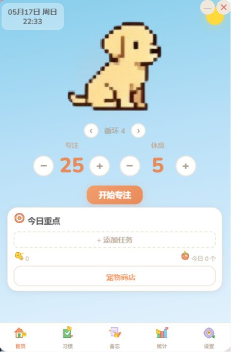
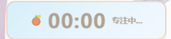

<div align="center">

# 🐾 PawFocus-学习伙伴

一款常驻桌面的番茄钟应用，搭配像素风宠物陪伴。专注学习赚取金币，解锁更多宠物伙伴。

[](../../releases)
[](LICENSE)
[](../../stargazers)

[]()
[]()
[]()
[]()

</div>

---

<div align="center">



</div>

---

## ✨ 功能一览

| | |
| :--- | :--- |
| ⏱️ **番茄钟** | 倒计时 / 正计时双模式，短休息 / 长休息循环，迷你悬浮窗随时可见 |
| 💰 **金币系统** | 完成专注获得金币，完美专注额外加成，连击触发倍数奖励 |
| 🐕 **宠物系统** | 领养小猫或小狗，用金币解锁更多宠物，随时改名切换 |
| ✅ **习惯打卡** | 每日 / 工作日 / 每 N 天 / 指定星期几，日历视图回溯编辑 |
| 📝 **备忘便签** | 分类标签 + 截止日期，拖拽排序，双击编辑 |
| 📊 **数据统计** | 今日 / 累计专注时长，本周柱状图，连续打卡天数 |
| ⚙️ **个性化设置** | 调整工作 / 休息时长，开关音效、通知、健康提醒 |
| 🔔 **贴心提醒** | 系统托盘常驻，喝水 / 护眼 / 起身健康提醒，完成推送通知 |



---

## 💻 下载安装

| 平台 | 安装包 |
| :--- | :--- |
| 🪟 Windows x64 | [PawFocus_0.1.0_x64-setup.exe](../../releases/latest) |

更多版本请在 [Releases](../../releases) 页面获取。

### 平台支持

| 平台 | 状态 | 说明 |
| :--- | :--- | :--- |
| 🪟 Windows x64 | ✅ 可用 | 提供 NSIS 安装包，下载即用 |
| 🐧 Linux | ⚠️ 需自行构建 | 已配置 `deb` + `appimage` 目标，需在 Linux 环境（或 WSL）下运行 `npm run tauri build` |
| 🍎 macOS | ❌ 暂不支持 | 需 Mac 电脑进行构建和签名，目前无可用环境 |
| 📱 iOS / Android | ⏳ 规划中 | 后续版本计划支持（需升级至 Tauri v2） |

---

## 🛠️ 开发指南

### 环境要求

- [Node.js](https://nodejs.org/) 18+
- [Rust](https://www.rust-lang.org/)

### 常用命令

```bash
# 安装依赖
npm install

# 开发模式
npm run tauri dev

# 构建安装包
npm run tauri build
```

构建产物位于 `src-tauri/target/release/bundle/nsis/`。

---

## 🧩 技术栈

| 领域 | 技术 |
| :--- | :--- |
| 前端框架 | [Vue 3](https://vuejs.org/) + Composition API |
| 语言 | [TypeScript](https://www.typescriptlang.org/) |
| 构建工具 | [Vite](https://vitejs.dev/) |
| 桌面端 | [Tauri v1](https://tauri.app/) (Rust) |
| 状态管理 | [Pinia](https://pinia.vuejs.org/) |
| 样式 | CSS Variables |
| 图标 | 手绘像素风格 SVG |

---

## 🙏 致谢

PawFocus 基于以下优秀的开源项目构建：

| 项目 | 许可 | 用途 |
| :--- | :--- | :--- |
| [Vue.js](https://github.com/vuejs/core) | MIT | 响应式前端框架 |
| [Tauri](https://github.com/tauri-apps/tauri) | Apache-2.0 / MIT | 跨平台桌面应用框架 |
| [Vite](https://github.com/vitejs/vite) | MIT | 下一代前端构建工具 |
| [Pinia](https://github.com/vuejs/pinia) | MIT | Vue 状态管理方案 |

感谢所有开源贡献者 💛

---

## 📜 许可

```text
MIT License

Copyright (c) 2025 PawFocus Contributors

Permission is hereby granted, free of charge, to any person obtaining a copy
of this software and associated documentation files (the "Software"), to deal
in the Software without restriction, including without limitation the rights
to use, copy, modify, merge, publish, distribute, sublicense, and/or sell
copies of the Software, and to permit persons to whom the Software is
furnished to do so, subject to the following conditions:

The above copyright notice and this permission notice shall be included in all
copies or substantial portions of the Software.

THE SOFTWARE IS PROVIDED "AS IS", WITHOUT WARRANTY OF ANY KIND, EXPRESS OR
IMPLIED, INCLUDING BUT NOT LIMITED TO THE WARRANTIES OF MERCHANTABILITY,
FITNESS FOR A PARTICULAR PURPOSE AND NONINFRINGEMENT. IN NO EVENT SHALL THE
AUTHORS OR COPYRIGHT HOLDERS BE LIABLE FOR ANY CLAIM, DAMAGES OR OTHER
LIABILITY, WHETHER IN AN ACTION OF CONTRACT, TORT OR OTHERWISE, ARISING FROM,
OUT OF OR IN CONNECTION WITH THE SOFTWARE OR THE USE OR OTHER DEALINGS IN THE
SOFTWARE.
```

完整许可文本见 [LICENSE](LICENSE) 文件。
